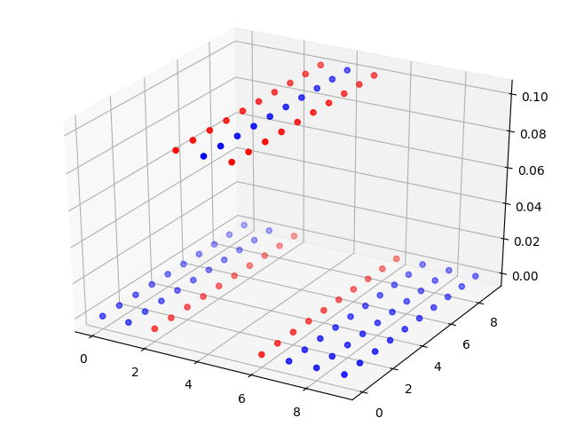

op_tools
========================

# op_tools

Tools for the order parameters calculation.
Python module for [order parameter](https://en.wikipedia.org/wiki/Phase_transition#Order_parameters) analysis for molecular and particle simulation.
This module evaluete the particle environment as a value.
In molecular simulation, there are often cases where you want to mechanically determine the structure of a particle.
For example, when melting simulating of solid metal, you may want to visualize how it melts.
You can use such a module at such a time.

# Description

Many order parameters are being developed for many purposes.
However, scince these were developed for specific purposes, there was few software that could compare performance of accuracy.
I developed a program that can perform the benchmark of the many types of order parameters.

# Demo



A figure with color after converting the environment of the individual particle into a numerical value.

# Requirement

nose
numpy
pyquaternion
sympy
matplotlib

# Usage

See manual and tutorial.

# Install

```
$ git clone https://github.com/hdoi/op_tools.git
$ cd op_tools  
$ pip3 install -e .  
or 
$ pip3 install -e . --user  
```

# Papers

This software can reproduce those articles.

- H. Doi, K.Z. Takahashi, T. Aoyagi, J. Phys. Chem. A 125 (2021) 9518–9526.
- H. Doi, K.Z. Takahashi, T. Aoyagi, J. Comput. Chem. 42 (2021) 1720–1727.
- H. Doi, K.Z. Takahashi, T. Aoyagi, J. Chem. Phys. 154 (2021) 164505.
- H. Doi, K.Z. Takahashi, T. Aoyagi, J. Chem. Phys. 152 (2020) 214501.
- H. Doi, K.Z. Takahashi, K. Tagashira, J. Fukuda, T. Aoyagi, Sci. Rep. 9 (2019) 16370.


# Licence

[](https://opensource.org/licenses/MIT)

