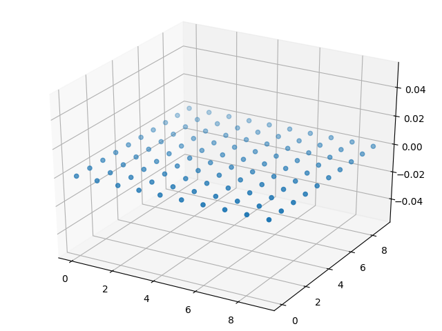
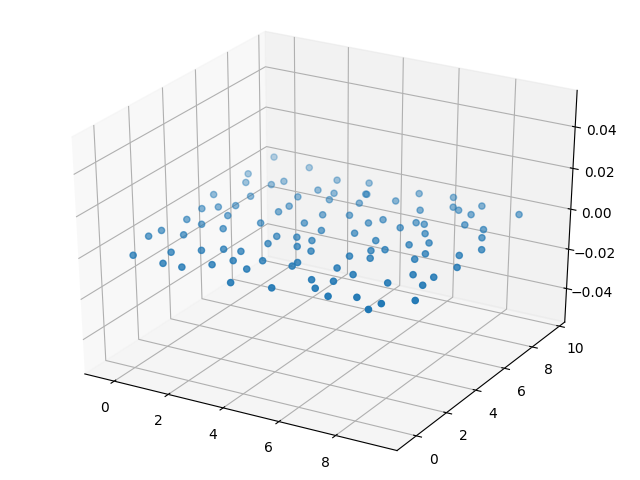
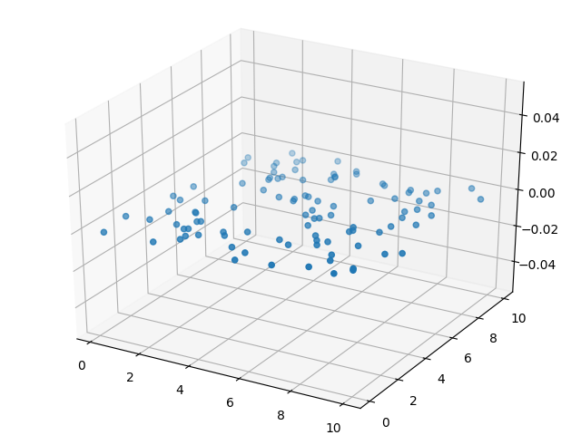
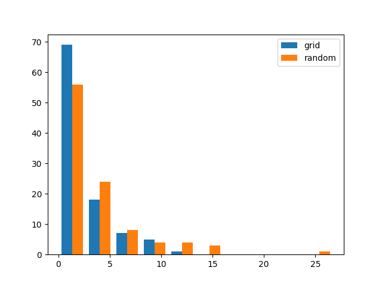
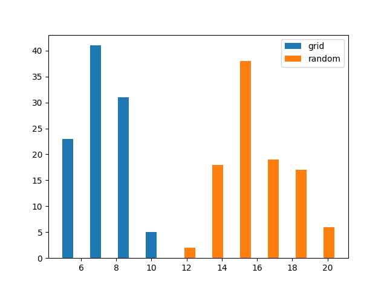
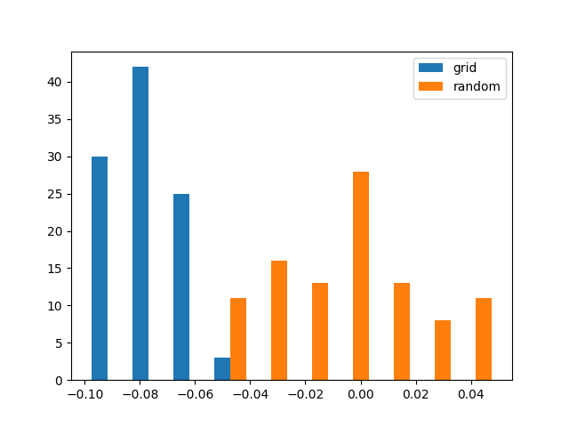
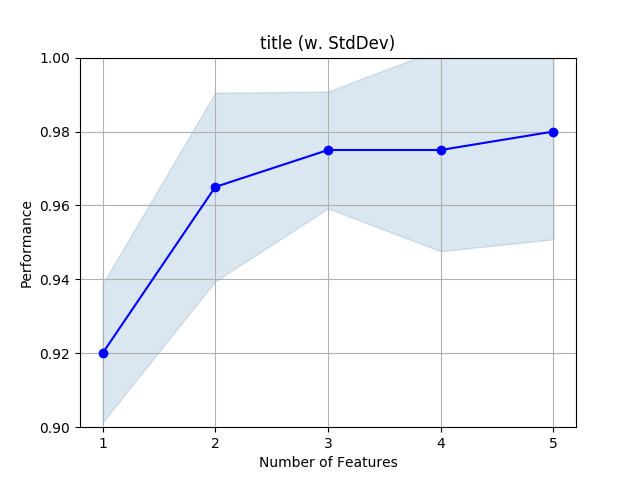
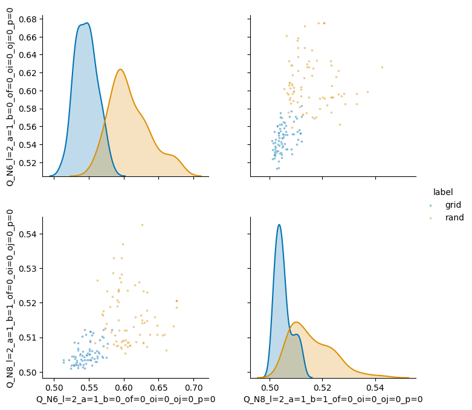

\newpage

# チュートリアル

ここでは、チュートリアルとしてop_toolsを使ってオーダーパラメータ解析を実際に行いながら、使い方を覚えるのが目的です。

# インストール

適切にインストールされていれば、python3のターミナル上で以下のコマンドで使用可能になるはずです。
```python
import op_tools
```
もし、import 出来なければ、マニュアルを参照してください。

# 基本 : 使ってみよう

ここでは、op_toolsの最低限の使用ができるようになることが目標です。
粒子の配置に対してop_toolsを使用し、解析を行います。
粒子の位置が変化した場合、変化した領域を調べるのにオーダーパラメータ解析を使用します。

それでは、使って行きましょう。解析に最低限のデータは座標とシミュレーションボックスのサイズです。
ここでは、100粒子に関して解析していきます。

```python
coord = [ [x,y,0] for x in range(10) for y in range(10) ]
sim_box = [10, 10, 10]
```
これで、変数coordに座標を代入することが出来ました。０から９までの整数が入っていて格子状になっています。
ここでは、単純化のためと可視化の簡単さのためにz座標を常に０にしています。
可視化してみましょう。
```python
from mpl_toolkits.mplot3d import Axes3D
import matplotlib.pyplot as plt
import numpy as np

x = [coord[i][0] for i in range(100)]
y = [coord[i][1] for i in range(100)]
z = [0 for i in range(100)]

fig = plt.figure()
ax = Axes3D(fig)
ax.scatter3D(x,y,z)
plt.show()
```
下記のような格子点が表示されているのを確認してください。

{width=8cm}

次に実際にオーダーパラメータを計算しましょう。
ここでは例としてneighborhood parameterと呼ばれるオーダーパラメータを計算しましょう。  
計算に使用するパラメータとして、どこまで近い粒子を隣の粒子(隣接粒子)として扱うかというものがあります。  
ここは、格子点ですから、隣の４つの粒子を隣接粒子と判定し、解析に使用することにしましょう。
変数op_settingの中には隣接粒子の設定(neighbor)の他に色々設定がありますが、詳しい事はマニュアルを見て下さい。
```python
op_setting = {
    'neighbor': [4],
    'ave_times': 0,
    'oi_oj': [0],
    'o_factor': [0.00],
    'm_in_A' : [2],
    'types_in_A' : ['N'],
    'analysis_type': ['A'] }

```
これで、必要なデータ（座標、シミュレーションボックスの長さ、計算条件）が揃いました。
方向ベクトルが存在するシミュレーションでは、指定するのですが、今回は質点の解析なので、空のリスト([])で良いでしょう。
また、スレッド数を指定するthread_num も1で良いでしょう。
次で計算を行います。
```python
direct = []
thread_num = 1
order_parameter = op_tools.op_analyze(coord, direct, sim_box, op_setting, thread_num)
```
解析が終わると以下の様な表示がされるはずです。
```
# CNP A elap time  0.11025261878967285
```
それでは、解析された結果のorder_parameterの中身を見ていきましょう。
```python
print(order_parameter)
# 
for i, v in order_parameter.items():
  print(i,v)
```
などとすれば中身が表示されます。
```
{'A_N4_a=0_type=N_m=2_of=0.0_oi=0_oj=0_ok=0': [0.0, 0.0, 0.0, 0.0, 0.0, .... ]}
```
と表示されていれば解析は成功です。
戻り値として、dict型のデータが戻ってきており、キーとしてオーダーパラメータの名前が、値として、オーダーパラメータのデータが得られます。  
オーダーパラメータの名前としては、"A_"の部分がオーダーパラメータの種類、"N4"の"N"の部分が隣接粒子の指定の部分で、近い粒子から数えて4番目までを考慮に入れる意味になります。その後の"a=0_..."以下の箇所はオーダーパラメータのためのオプションになります。詳しくはマニュアルを参照してください。  
このオーダーパラメータAは、完璧な格子であれば０をそうでなければ０以外の値を持つオーダーパラメータです。
そのため、ここでは完璧な格子の構造を与えているためすべての値が０になります。  
それでは、少し粒子を動かして見ましょう。
```python
coord[0][0] += 0.1
order_parameter = op_tools.op_analyze(coord, direct, sim_box, op_setting, 1)
print(order_parameter)
```
とすれば、以下の結果が返ってくるはずです。
```
{'A_N4_a=0_type=N_m=2_of=0.0_oi=0_oj=0_ok=0': [0.15999999999999992, .... ]}
```
最初の粒子の位置を少し動かしたため、最初の値が少し変化しているのがわかります。
それでは、より大きく位置を変化させて見ましょう。
```python
coord = [ [x,y,0] for x in range(10) for y in range(10) ]
for i in range(30,60):
    coord[i][2] += 1
x = [coord[i][0] for i in range(100)]
y = [coord[i][1] for i in range(100)]
z = [coord[i][2] for i in range(100)]
order_parameter = op_tools.op_analyze(coord, direct, sim_box, op_setting, 1)
```
として解析を行い、オーダーパラメータの値に従って色をつけ散布図を作成します。
```python
colormap = plt.get_cmap("bwr")
import matplotlib.colors
op = order_parameter['A_N4_a=0_type=N_m=2_of=0.0_oi=0_oj=0_ok=0']
norm = matplotlib.colors.Normalize(vmin=min(op), vmax=max(op))
fig = plt.figure()
ax = Axes3D(fig)
ax.scatter3D(x,y,z, c=colormap(norm(op)))
plt.show()
```
下のように、動かした粒子の縁の部分のみ青から赤に色が変わっているのがわかります。
”縁”の部分のみ色がつくことが重要です。周囲の環境を評価し、他と違う環境にある粒子に色をつけることが出来たということです。

{width=8cm}

op_toolsは、他にも色々な種類のオーダーパラメータを色々な条件で計算できます。
詳しくはマニュアルをご覧ください。


# 基本 : 粒子の並び方の違いを見分ける

次に、結晶構造を見分けて見ましょう。
例として、ゆらぎのある格子構造と全くのランダムな構造を見てみましょう。
normalvariateを使って、平均0、分散0.3の正規分布に従う乱数を発生させて座標に加えています。
この正規分布に従う乱数はゆらぎを模倣しています。

```python
from random import seed
from random import normalvariate
from random import random

seed(9999)
coord_grid = [[ x + normalvariate(0,0.3),
                y + normalvariate(0,0.3),
                0 ] for x in range(10) for y in range(10)]
coord_random = [[ 10*random(),
                  10*random(),
                  0 ] for x in range(10) for y in range(10)]
```
可視化してみましょう。
```python
from mpl_toolkits.mplot3d import Axes3D
import matplotlib.pyplot as plt
import numpy as np

def coord_to_xyz(coord):
  x = [coord[i][0] for i in range(100)]
  y = [coord[i][1] for i in range(100)]
  z = [coord[i][2] for i in range(100)]
  return [x,y,z]
[x,y,z] = coord_to_xyz(coord_grid)
fig = plt.figure()
ax = Axes3D(fig)
ax.scatter3D(x,y,z)

[x,y,z] = coord_to_xyz(coord_random)
fig = plt.figure()
ax = Axes3D(fig)
ax.scatter3D(x,y,z)
plt.show()
```
{width=8cm}

{width=8cm}


見た目では違いがあるかないかを見分けるのは少しむずかしそうだなというのがわかると思います。
それではオーダーパラメータを計算して行きましょう。
ここでも例としてneighborhood parameterと呼ばれるオーダーパラメータを計算してみます。  
```python
import op_tools
op_setting = {
    'neighbor': [4],
    'ave_times': 0,
    'oi_oj': [0],
    'o_factor': [0.00],
    'm_in_A' : [2],
    'types_in_A' : ['N'],
    'analysis_type': ['A'] }
direct = []
thread_num = 1
order_parameter_grid = op_tools.op_analyze(coord_grid, direct, sim_box, op_setting, thread_num)
order_parameter_random = op_tools.op_analyze(coord_random, direct, sim_box, op_setting, thread_num)
```
これで、ゆらぎのある座標と、完璧にランダムな座標の解析を行う事ができました。
order_parameter_gridのデータは、ゆらぎのある系のデータが、
order_parameter_randomのデータは、まったくのランダムの系のデータが入っています。
この2つを見分けることができるかどうかをヒストグラムを描いて確かめて見ましょう。
```python
fig = plt.figure()
grid_op = order_parameter_grid['A_N4_a=0_type=N_m=2_of=0.0_oi=0_oj=0_ok=0']
random_op = order_parameter_random['A_N4_a=0_type=N_m=2_of=0.0_oi=0_oj=0_ok=0']
plt.hist([grid_op, random_op], label=['grid', 'random'])
plt.legend(loc='upper right')
plt.show()
```
{width=8cm}

ほとんど同じです。これでは見分ける事ができません。
このような状況になった場合は、決定的な解決法はありませんが、
1, 隣接粒子の数を増やす。 2, 'ave_times' の数を増やす。 3, オーダーパラメータの種類を変える。 といった方法があります。
1と2は、使える情報が増えます。周囲4粒子では違いがなくとも8粒子、12粒子と増えるに従ってより違いがはっきりとしてくるでしょうから。  
それでは、以下の設定でオーダーパラメータの計算を行って見ましょう。

```python
op_setting = {
    'neighbor': [16],
    'ave_times': 2,
    'oi_oj': [0],
    'o_factor': [0.00],
    'm_in_A' : [2],
    'types_in_A' : ['N'],
    'analysis_type': ['A'] }
direct = []
thread_num = 1
order_parameter_grid = op_tools.op_analyze(coord_grid, direct, sim_box, op_setting, thread_num)
order_parameter_random = op_tools.op_analyze(coord_random, direct, sim_box, op_setting, thread_num)

fig = plt.figure()
grid_op = order_parameter_grid['A_N16_a=2_type=N_m=2_of=0.0_oi=0_oj=0_ok=0']
random_op = order_parameter_random['A_N16_a=2_type=N_m=2_of=0.0_oi=0_oj=0_ok=0']
plt.hist([grid_op, random_op], label=['grid', 'random'])
plt.legend(loc='upper right')
plt.show()
```

{width=8cm}

これで、ひとまず分離するようになりました。
研究で使用するときは、データ数を増やしたり、調べるパラメータの種類を増やす事が必要ですが基本的にやっていることはかわりません。

# 発展 : 性能の良いオーダーパラメータを探索する

ここからは発展編です。性能の良いオーダーパラメータを機械に探させます。
粒子の構造は同じで良いでしょう。

```python
import op_tools
from random import seed
from random import normalvariate
from random import random

seed(9999)

coord_grid = [[ x + normalvariate(0,0.3),
                y + normalvariate(0,0.3), 
                0 ] for x in range(10) for y in range(10)]
coord_random = [[ 10*random(),
                  10*random(),
                  0 ] for x in range(10) for y in range(10)]

def f_1(r):
  return r
def f_2(r):
  return 1/r

op_settings = {
  'neighbor' : [4,6,8],
  'ave_times': 1,
  'oi_oj'    : [0], 'o_factor' : [0],
  'op_types' : ['A','P','N'], 'm_in_A'  : [1,2],
  'm_in_B'   : [2], 'n_in_B'            : [1, 2], 'phi_in_B'         : [0],
  'function' : [f_1, f_2], 'l_in_F'     : [1],
  'b_in_H'   : 1, 'bin_in_H'            : [24], 'nu_in_H'            : [3],
  'b_in_Q'   : 1, 'l_in_Q'              : [2, 4, 6, 8, 12], 'p_in_Q' : [0],
  'n_in_S'   : [2], 'n_in_T'            : [2], 'd_in_T'              : [1.0],
  'analysis_type' : ['A', 'B', 'C', 'D', 'F', 'H', 'I', 'Q', 'W', 'S', 'T']}
direct = []
thread_num = 3
sim_box= [10,10,10]
order_parameter_grid = op_tools.op_analyze(coord_grid, direct, sim_box, op_settings, thread_num)
order_parameter_random = op_tools.op_analyze(coord_random, direct, sim_box, op_settings, thread_num)
```
この例でのop_settingsでは、実装されているすべてのオーダーパラメータを様々な条件で計算する計算条件です。
この中から、性能の良いオーダーパラメータを探すのが目的です。
まず、データのラベルを用意し、2つの系のデータを持つDataFrameを作成します。
pd.concatでデータフレームを結合しています。
100粒子の解析ですので、100個のラベルを割り振っています。

```python
order_parameter_grid['label'] = ['grid' for i in range(100)]
order_parameter_random['label'] = ['rand' for i in range(100)]
import pandas as pd
df_grid = pd.DataFrame(order_parameter_grid)
df_random = pd.DataFrame(order_parameter_random)
df = pd.concat([df_grid, df_random])
print(df.head())
```
それから、学習のためにデータを分けます。
回答を含まないデータと回答を含むデータに分けます。
```python
# split data
train_x = df.drop('label', axis=1)
train_y = df['label']
```
交差検証のためのラッパーを作ります。
これで、5 foldの交差検証を行い、5回の試行での正確性を返します。
```python
from sklearn.ensemble import RandomForestClassifier
from sklearn.model_selection import StratifiedKFold
from sklearn.model_selection import cross_val_score
def cross_val_wrap(clf, train_x, train_y):
    split_num = 5
    cv = StratifiedKFold(n_splits=split_num, random_state=666, shuffle=True)
    acc_all = cross_val_score(
        clf, train_x, train_y, cv=cv, scoring='accuracy', n_jobs=3)
    return acc_all
```
次に、各オーダーパラメータを一つ取り出し、分類のタスクを行い正確性の平均を計算します。
良いオーダーパラメータであれば、正確性が高くなるはずです。

```python
import numpy as np

acc_data = {}
for ivar in train_x:
    train_x_1feat = train_x.loc[:, [str(ivar)]]
     
    clf = RandomForestClassifier(n_estimators=100)
    acc_all = cross_val_wrap(clf, train_x_1feat, train_y)
    acc_data[ivar] = np.average(acc_all)
```
そこで、上位10位のオーダーパラメータの名前と正確性を出力します。
```python
ranking =  sorted(acc_data, key=acc_data.get, reverse=True)
for i in range(min(len(ranking), 10)):
    print(i, ranking[i], acc_data[ranking[i]])
```
これで、良い性能のオーダーパラメータが見つかりました。
1位でも性能が良く無い場合は、隣接粒子を増やしたり、 ave_timesの数値を増やしたりしてください。
出力は以下のようになるはずです。

```
0 F_N8_a=1_of=0_oi=0_oj=0_ok=0_f1=0_f2=1_l=1 0.9800000000000001
1 I_N8_a=1_of=0_oi=0_oj=0_ok=0 0.975
2 I_N6_a=1_of=0_oi=0_oj=0_ok=0 0.96
3 F_N8_a=1_of=0_oi=0_oj=0_ok=0_f1=0_f2=0_l=1 0.95
4 Q_N6_l=2_a=1_b=0_of=0_oi=0_oj=0_p=0 0.9350000000000002
5 D_N8_a=1_of=0_oi=0_oj=0_ok=0_f1=1_f2=0_f3=1 0.9299999999999999
6 B_N6_a=1_m=2_phi=0_n=1_of=0_oi=0_oj=0_ok=0 0.925
7 F_N6_a=1_of=0_oi=0_oj=0_ok=0_f1=0_f2=1_l=1 0.915
8 D_N8_a=1_of=0_oi=0_oj=0_ok=0_f1=1_f2=1_f3=1 0.9
9 D_N4_a=1_of=0_oi=0_oj=0_ok=0_f1=1_f2=1_f3=0 0.885
```
なかなかの性能のオーダーパラメータが見つかりましたね。
1位が正答率98%です。
このオーダーパラメータのヒストグラムを描いて見ましょう。

```python
import matplotlib.pyplot as plt
fig = plt.figure()
grid_op = order_parameter_grid['F_N8_a=1_of=0_oi=0_oj=0_ok=0_f1=0_f2=1_l=1']
random_op = order_parameter_random['F_N8_a=1_of=0_oi=0_oj=0_ok=0_f1=0_f2=1_l=1']
plt.hist([grid_op, random_op], label=['grid', 'random'])
plt.legend(loc='upper right')
plt.show()
```

なかなか良さそうですね。

{width=8cm}

研究ではよりデータ数を多く、広範囲の条件を探索しますが、基本はこのような感じです。

# 発展 : オーダーパラメータを組み合わせて使う

先程までは、多くのオーダーパラメータから性能の良いオーダーパラメータを1つ探すという解析でした。
しかし、都合よく見つかるとは限りません。
そこで、複数のオーダーパラメータを組み合わせて使う事を考えます。

ここからは、機械学習の話が多くなるのでオーダーパラメータの事を特徴量と呼びます。
特徴量は、学習に使う数値やデータの事ですので、オーダーパラメータは粒子の特徴を反映している数値であり、特徴量の一つということになります。

いつものように座標を生成して解析を行います。

```python
import op_tools
from random import seed
from random import normalvariate
from random import random

seed(9999)

coord_grid = [[ x + normalvariate(0,0.3),
                y + normalvariate(0,0.3), 
                0 ] for x in range(10) for y in range(10)]
coord_random = [[ 10*random(),
                  10*random(),
                  0 ] for x in range(10) for y in range(10)]

op_settings = {
  'neighbor' : [4,6,8],
  'ave_times': 1,
  'oi_oj'    : [0], 'o_factor' : [0],
  'b_in_Q'   : 1, 'l_in_Q'              : [2, 4, 6, 8, 12], 'p_in_Q' : [0],
  'analysis_type' : ['Q']}
direct = []
thread_num = 3
sim_box= [10,10,10]
order_parameter_grid = op_tools.op_analyze(coord_grid, direct, sim_box, op_settings, thread_num)
order_parameter_random = op_tools.op_analyze(coord_random, direct, sim_box, op_settings, thread_num)

order_parameter_grid['label'] = ['grid' for i in range(100)]
order_parameter_random['label'] = ['rand' for i in range(100)]
import pandas as pd
df_grid = pd.DataFrame(order_parameter_grid)
df_random = pd.DataFrame(order_parameter_random)
df = pd.concat([df_grid, df_random])
```
これで何種類かのオーダーパラメータが計算されました。
先程は、1種類で性能の出るオーダーパラメータを計算していました。
```python
# split data
train_x = df.drop('label', axis=1)
train_y = df['label']

from sklearn.ensemble import RandomForestClassifier
from sklearn.model_selection import StratifiedKFold
from sklearn.model_selection import cross_val_score
def cross_val_wrap(clf, train_x, train_y):
    split_num = 5
    cv = StratifiedKFold(n_splits=split_num, random_state=666, shuffle=True)
    acc_all = cross_val_score(
        clf, train_x, train_y, cv=cv, scoring='accuracy', n_jobs=3)
    return acc_all

import numpy as np

acc_data = {}
for ivar in train_x:
    train_x_1feat = train_x.loc[:, [str(ivar)]]
     
    clf = RandomForestClassifier(n_estimators=100)
    acc_all = cross_val_wrap(clf, train_x_1feat, train_y)
    acc_data[ivar] = np.average(acc_all)
ranking =  sorted(acc_data, key=acc_data.get, reverse=True)
for i in range(min(len(ranking), 10)):
    print(i, ranking[i], acc_data[ranking[i]])
```
得られた正答率としては、
```python
0 Q_N6_l=2_a=1_b=0_of=0_oi=0_oj=0_p=0 0.9350000000000002
1 Q_N8_l=2_a=1_b=1_of=0_oi=0_oj=0_p=0 0.8550000000000001
2 Q_N4_l=2_a=1_b=0_of=0_oi=0_oj=0_p=0 0.845
3 Q_N8_l=2_a=1_b=0_of=0_oi=0_oj=0_p=0 0.8150000000000001
4 Q_N8_l=4_a=1_b=0_of=0_oi=0_oj=0_p=0 0.8150000000000001
5 Q_N8_l=4_a=1_b=1_of=0_oi=0_oj=0_p=0 0.8
6 Q_N8_l=6_a=1_b=1_of=0_oi=0_oj=0_p=0 0.7749999999999999
7 Q_N6_l=6_a=1_b=0_of=0_oi=0_oj=0_p=0 0.765
8 Q_N4_l=6_a=1_b=0_of=0_oi=0_oj=0_p=0 0.7350000000000001
9 Q_N4_l=6_a=1_b=1_of=0_oi=0_oj=0_p=0 0.735
```
となっていて、１種類の特徴量では正答率0.935までしか上がりません。
そこで、複数を組み合わせて使う事を考えます。
どの特徴量とどの特徴量を組み合わせれば性能が上がるかは難しいのですが、特徴量選択の技術を使うと比較的簡単に性能を上げる事が可能です。
さっくりとした説明ですが、以下のような方法のようです。
1. 性能の高い特徴量を選ぶ。
2. 1.の特徴量と組み合わせて性能の出る特徴量を選ぶ。
3. 2.を再び行い、特徴量を増やして行く。
他にもより賢く行う方法などがあります。
ともかく、以下で可能です。
```python
from mlxtend.feature_selection import SequentialFeatureSelector as SFS
from mlxtend.plotting import plot_sequential_feature_selection as plot_sfs
import matplotlib.pyplot as plt

n_feature = 5
sfs1 = SFS(clf, k_features=n_feature,
         forward=True, floating=False, verbose=0, scoring='accuracy', cv=5, n_jobs=5)
sfs = sfs1.fit(train_x, train_y)
feature_index = sfs1.k_feature_idx_

fig1 = plot_sfs(sfs.get_metric_dict(), kind='std_dev')
plt.ylim([0.5, 1])
plt.title('title' + ' (w. StdDev)')
plt.grid()
plt.show()
plt.savefig('feature_selection.png')

```
{width=8cm}

1つの特徴量では0.92程度の特徴量であったが、2つの特徴量では0.96程度、3つの特徴量では0.98程度に正答率を上げる事が出来た。
どの特徴量を組み合わせているのかを確かめよう。

```python
metric = pd.DataFrame.from_dict(sfs.get_metric_dict()).T
metric.to_csv('sfs_metric.dat')

import pandas as pd
metric = pd.read_csv('sfs_metric.dat')
# 1 avg_score
# 2 ci_bound
# 3 cv_scores
# 4 feature_idx
# 5 feature_names
print('num of feat, avg_score, feature_name')
for i in range(0, 5):
    avg_score = metric.iloc[i, 1]
    ci_bound = metric.iloc[i, 2]
    feature_idx = eval(metric.iloc[i, 4])
    feature_name = eval(metric.iloc[i, 5])
    print(i+1, avg_score, feature_name)
```
以下のような出力だろうと思います。
これで特徴量の数、正答率、特徴量の名前が判明しました。
```
num of feat, avg_score, feature_name
1 0.9200000000000002 ('Q_N6_l=2_a=1_b=0_of=0_oi=0_oj=0_p=0',)
2 0.97 ('Q_N6_l=2_a=1_b=0_of=0_oi=0_oj=0_p=0', 'Q_N8_l=2_a=1_b=1_of=0_oi=0_oj=0_p=0')
3 0.98 ('Q_N4_l=2_a=1_b=0_of=0_oi=0_oj=0_p=0', 'Q_N6_l=2_a=1_b=0_of=0_oi=0_oj=0_p=0', 'Q_N8_l=2_a=1_b=1_of=0_oi=0_oj=0_p=0')
4 0.985 ('Q_N4_l=2_a=1_b=0_of=0_oi=0_oj=0_p=0', 'Q_N4_l=4_a=1_b=0_of=0_oi=0_oj=0_p=0', 'Q_N6_l=2_a=1_b=0_of=0_oi=0_oj=0_p=0', 'Q_N8_l=2_a=1_b=1_of=0_oi=0_oj=0_p=0')
5 0.99 ('Q_N4_l=2_a=1_b=0_of=0_oi=0_oj=0_p=0', 'Q_N4_l=4_a=1_b=0_of=0_oi=0_oj=0_p=0', 'Q_N4_l=8_a=1_b=0_of=0_oi=0_oj=0_p=0', 'Q_N6_l=2_a=1_b=0_of=0_oi=0_oj=0_p=0', 'Q_N8_l=2_a=1_b=1_of=0_oi=0_oj=0_p=0')
```
どうやら$l=2$が良さそうです。次点で$l=4,8$が良さそうです。
ついでにpairplotも描いておきましょう。
どの程度、各分布が離れているのか確認できます。

データが大きい時の事を考えて、train_test_splitで適当に良い大きさにデータを間引く方法を行います。
```python
from sklearn.model_selection import train_test_split
(train_d, test_d) = train_test_split(df, test_size=0.8, random_state=666)
```
散布図を描きます。
```python
import seaborn as sns
sns.pairplot(test_d, hue="label", plot_kws={'alpha': 0.5, 's': 8},
             vars=['Q_N6_l=2_a=1_b=0_of=0_oi=0_oj=0_p=0',
                   'Q_N8_l=2_a=1_b=1_of=0_oi=0_oj=0_p=0'],
             size=3.5, palette='colorblind').savefig('pairplot.png')
```
これで以下の図が描けます。
{width=8cm}

少しデータ数が少ないですが、分離している様子は確認できました。

複数の特徴量を使って構造を分離したい場合は、このように最適な組み合わせ、いくつまで組み合わせば良いのかを確認した方が良いでしょう。

# 発展 : 学習した結果を保存する。

先程までの結果で、どの特徴量を使用すると性能が出るか判明しました。
そこで、実際に学習を行った結果を保存し、使いまわせるようにしましょう。
以下のようにデータを生成します。
```python
import op_tools
from random import seed
from random import normalvariate
from random import random

seed(9999)

coord_grid = [[ x + normalvariate(0,0.3),
                y + normalvariate(0,0.3), 
                0 ] for x in range(10) for y in range(10)]
coord_random = [[ 10*random(),
                  10*random(),
                  0 ] for x in range(10) for y in range(10)]

op_settings = {
  'neighbor' : [6],
  'ave_times': 1,
  'oi_oj'    : [0], 'o_factor' : [0],
  'b_in_Q'   : 1, 'l_in_Q' : [2, 4, 8], 'p_in_Q' : [0],
  'analysis_type' : ['Q']}
direct = []
thread_num = 3
sim_box= [10,10,10]
order_parameter_grid = op_tools.op_analyze(coord_grid, direct, sim_box, op_settings, thread_num)
order_parameter_random = op_tools.op_analyze(coord_random, direct, sim_box, op_settings, thread_num)

order_parameter_grid['label'] = ['grid' for i in range(100)]
order_parameter_random['label'] = ['rand' for i in range(100)]
import pandas as pd
df_grid = pd.DataFrame(order_parameter_grid)
df_random = pd.DataFrame(order_parameter_random)
df = pd.concat([df_grid, df_random])
```
次に、学習を行っていきます。
```python
from sklearn.model_selection import train_test_split
# split data
train_y = df.label
train_x = df.drop(label, axis=1)

(train_x2, test_x2, train_y2, test_y2) = train_test_split(
    train_x, train_y, test_size=0.3, random_state=666)

# random forest
clf = RandomForestClassifier(n_estimators=100)

# train and predict
clf_fit = clf.fit(train_x2, train_y2)
pred = clf_fit.predict(test_x2)

# show accuracy
from sklearn.metrics import accuracy_score
acc = accuracy_score(pred, test_y2)
print(acc)
```
ここで、学習済みモデルである clf_fit を保存しましょう。
保存する方法は主に２通りあり、pickleとjoblibを使用した方法がありますが、大きなnumpy配列を使用する場合はjoblibの方が良いようです。
それでは、保存しましょう。
```python
from sklearn.externals import joblib
joblib.dump(clf_fit, 'model1.joblib')
```
それでは、保存したモデルを読み込み、予測を行いましょう。
```python
clf_load = joblib.load('model1.joblib')
pred = clf_load.predict(test_x2)
acc = accuracy_score(pred, test_y2)
print('load model', acc)
```
どうやら予測が出来ているようですね。
次に、別のデータを用意し、予測を行いましょう。
ここでは、ランダムの座標データを作り、本当にランダムな座標データとして認識される事を確認しましょう。
まず、ランダムな座標を生成し、オーダーパラメータ計算を行い、DataFrameに変換します。
尚、予測を行うだけなので、labelを用意する必要はありません。
```python
# gen random coordinate
coord_random = [[10*random(),
                 10*random(),
                 0] for x in range(10) for y in range(10)]

op_settings = {
    'neighbor': [6],
    'ave_times': 1,
    'oi_oj': [0], 'o_factor': [0],
    'b_in_Q': 1, 'l_in_Q': [2, 4, 8], 'p_in_Q': [0],
    'analysis_type': ['Q']}
direct = []
thread_num = 3
sim_box = [10, 10, 10]
order_parameter_random = op_tools.op_analyze(
    coord_random, direct, sim_box, op_settings, thread_num)
df_random = pd.DataFrame(order_parameter_random)
```
予測を行います。
```python
pred = clf_load.predict(df_random)
print(pred)
```
以下の結果がでるはずです。
```python
['grid' 'grid' 'rand' 'rand' 'rand' 'grid' 'grid' 'grid' 'grid' 'grid'
 'grid' 'rand' 'grid' 'grid' 'rand' 'rand' 'grid' 'rand' 'grid' 'rand'
 'grid' 'grid' 'rand' 'rand' 'rand' 'rand' 'rand' 'rand' 'rand' 'rand'
 'rand' 'rand' 'grid' 'grid' 'rand' 'rand' 'rand' 'grid' 'rand' 'grid'
 'grid' 'rand' 'rand' 'rand' 'rand' 'grid' 'grid' 'rand' 'rand' 'grid'
 'grid' 'rand' 'rand' 'rand' 'grid' 'rand' 'rand' 'rand' 'rand' 'grid'
 'grid' 'grid' 'rand' 'rand' 'grid' 'rand' 'grid' 'grid' 'rand' 'rand'
 'rand' 'rand' 'grid' 'rand' 'grid' 'rand' 'grid' 'grid' 'grid' 'rand'
 'grid' 'rand' 'grid' 'rand' 'rand' 'grid' 'grid' 'rand' 'rand' 'rand'
 'rand' 'grid' 'rand' 'grid' 'rand' 'rand' 'grid' 'rand' 'rand' 'grid']
```
分類を行う事には成功していますね。
このようにして、1:モデルの保存、2:モデルの読み込み、3:モデルを使った分類を行う事ができます。

次に実用上の注意を書いておきます。
学習や予測に使用する特徴量は、特徴量選択を行ったりして削除することがよく有ります。
その時、読み込ませる特徴量が学習をさせていた時の特徴量と違ってしまう場合があります。
このような場合は、以下のエラーが出ます。
```python
ValueError: Number of features of the model must match the input. Model n_features is 12 and input n_features is 8 
```

# 発展 : 特徴量の重要度を調べる

分類や回帰を行う時にどの特徴量が重要度がわかれば、重要でない特徴量がわかれば解析に非常に役立つ。
もちろん、使用する方法は重要度を計算する機能がなければならない。
また、複数の特徴量を用いて学習を行う必要がある。
まず、学習を行うか、学習済みモデルをロードする。
```python
# get importances features
from sklearn.model_selection import train_test_split
# split data
train_y = df.label
train_x = df.drop('label', axis=1)

(train_x2, test_x2, train_y2, test_y2) = train_test_split(
    train_x, train_y, test_size=0.3, random_state=666)

# random forest
from sklearn.ensemble import RandomForestClassifier
clf = RandomForestClassifier(n_estimators=100)
clf.fit(train_x2, train_y2)

```
次に、学習結果を利用し、記述子とその重要度を見る。
```python
# show impotance features
import numpy as np
num_importance = 10
features = train_x.columns
importances = clf.feature_importances_
indices = np.argsort(importances)[::-1]
importance_list = []
for i in range(min(len(indices), num_importance)):
    feat = indices[i]
    print("{0:4d}".format(i + 1), "{0:12s}".format(
        features[feat]), "{0:12.9f}".format(importances[feat]))
```

# 発展 : ハイパーパラメータの最適化

機械学習において、人が調整しなければならないパラメータをハイパーパラメータと言います。
例えば、RandomForestClassifierにおけるn_estimatorsとかがそうです。
他にも決定木の深さを指定するパラメータなどもあります。
このようなパラメータは多くの場合、モデルの性能や表現力と深く関わっています。
表現力の低いパラメータであれば、モデルの表現力が足りず正答率が低くなり、
表現力の高いパラメータでは過学習に陥りやすく、汎化性能が高くなりません。
このように、ハイパーパラメータを適切に選ぶ必要がありますが、当然ながら自動で行う方法があります。
実際にやってみましょう。
まず、いつものように座標を生成し、分類の予測を行います。

```python
import op_tools
from random import seed
from random import normalvariate
from random import random

seed(9999)

coord_grid = [[x + normalvariate(0, 0.3),
               y + normalvariate(0, 0.3),
               0] for x in range(10) for y in range(10)]
coord_random = [[10*random(),
                 10*random(),
                 0] for x in range(10) for y in range(10)]

op_settings = {
    'neighbor': [6],
    'ave_times': 1,
    'oi_oj': [0], 'o_factor': [0],
    'b_in_Q': 1, 'l_in_Q': [2, 4, 8], 'p_in_Q': [0],
    'analysis_type': ['Q']}
direct = []
thread_num = 3
sim_box = [10, 10, 10]
order_parameter_grid = op_tools.op_analyze(
    coord_grid, direct, sim_box, op_settings, thread_num)
order_parameter_random = op_tools.op_analyze(
    coord_random, direct, sim_box, op_settings, thread_num)

order_parameter_grid['label'] = ['grid' for i in range(100)]
order_parameter_random['label'] = ['rand' for i in range(100)]
import pandas as pd
df_grid = pd.DataFrame(order_parameter_grid)
df_random = pd.DataFrame(order_parameter_random)
df = pd.concat([df_grid, df_random])

# split data
train_x = df.drop('label', axis=1)
train_y = df['label']

from sklearn.model_selection import train_test_split
(train_x2, test_x2, train_y2, test_y2) = train_test_split(
    train_x, train_y, test_size=0.2, random_state=666)

from sklearn.ensemble import RandomForestClassifier
clf = RandomForestClassifier(n_estimators=100)

# train and predict
clf_fit = clf.fit(train_x2, train_y2)
pred = clf_fit.predict(test_x2)

# show accuracy
from sklearn.metrics import accuracy_score
acc = accuracy_score(pred, test_y2)
print(acc)
```
最適化前の正答率は 0.925 であった。
ここから、パラメータの最適化を行う。
具体的なパラメータの説明に関しては、scikit-learnの説明を見て下さい。
[RandomForestClassifierに関するパラメータ](https://scikit-learn.org/stable/modules/generated/sklearn.ensemble.RandomForestClassifier.html "RandomForestClassifier")
```python
# parameter search
params = {
    'n_estimators': [100],
    'max_depth': [1, 3, 5, None],
    'criterion': ['gini', 'entropy'],
    'max_features': [1, 3, 5, 'auto', None],
}
from sklearn.model_selection import GridSearchCV
clf_search = GridSearchCV(RandomForestClassifier(), params, scoring='accuracy', error_score='raise', cv=5)
clf_search.fit(train_x2, train_y2)

print('Best parameters: {}'.format(clf_search.best_params_))
print('Best score: {:.3f}'.format(clf_search.best_score_))
```
すると、以下のような結果が出ます。
```python
# Best parameters: {'criterion': 'entropy', 'max_depth': 3, 'max_features': 3, 'n_estimators': 100}
# Best score: 0.986
```
初期は0.9だった正答率が0.986まで上がりました。
正確に予測したい場合や本番環境では、このようなパラメータサーチを行って性能を上げると良いでしょう。

# 役に立つ機能

本当に解析を必要とする場合は、基本的にはかなり数が多くなります。
具体的には、粒子数が数万〜数十万粒子、オーダーパラメータの種類も数多くなります。
そのための工夫などを書いておきます。

## オーダーパラメータのデータをファイルに保存する

以下のように書くことでファイルに保存することができる。
いつものように、オーダーパラメータのデータを作ります。

```python
import op_tools
from random import seed
from random import normalvariate
from random import random

seed(9999)

coord_grid = [[x + normalvariate(0, 0.3),
               y + normalvariate(0, 0.3),
               0] for x in range(10) for y in range(10)]
coord_random = [[10*random(),
                 10*random(),
                 0] for x in range(10) for y in range(10)]

op_settings = {
    'neighbor': [4, 6, 8],
    'ave_times': 1,
    'oi_oj': [0], 'o_factor': [0],
    'b_in_Q': 1, 'l_in_Q': [2, 4, 6, 8, 12], 'p_in_Q': [0],
    'analysis_type': ['Q', 'W']}
direct = []
thread_num = 3
sim_box = [10, 10, 10]
order_parameter_grid = op_tools.op_analyze(
    coord_grid, direct, sim_box, op_settings, thread_num)
order_parameter_random = op_tools.op_analyze(
    coord_random, direct, sim_box, op_settings, thread_num)

order_parameter_grid['label'] = ['grid' for i in range(100)]
order_parameter_random['label'] = ['rand' for i in range(100)]
import pandas as pd
df_grid = pd.DataFrame(order_parameter_grid)
df_random = pd.DataFrame(order_parameter_random)
df = pd.concat([df_grid, df_random])
df.to_csv('QW.dat')
```


## 読み込む特徴量を減らす

以下は、複数ファイルから特徴量を読み込んで、パターンマッチした特徴量のみ読みこみます。

```python
import sys
import re
import pandas as pd

def read_df(pd_file_list, ng_pattern, ok_pattern):
    df = pd.DataFrame()

    for i in pd_file_list:
        df_temp = pd.read_csv(i, index_col=0)

        var_list = list(df_temp.columns)
        ng_list = []
        for s in var_list:
            ng = [s for j in range(len(ng_pattern))
                  if re.match(ng_pattern[j], s)]
            if ng != []:
                ng_list.append(ng[0])
        for j in ng_list:
            var_list.remove(j)

        ok_list = [s for s in var_list for j in range(
            len(ok_pattern)) if re.match(ok_pattern[j], s)]

        df = pd.concat([df, df_temp.loc[:, ok_list]], axis=1)
        df = df.loc[:, ~df.columns.duplicated()]

    return df

ng_pattern = ['.*a=1_b=1.*']
ok_pattern = ['.*a=0_b=1.*', '.*l=2.*', '.*label.*']
pd_file_list = ['QW.dat', 'QW2.dat']
df = read_df(pd_file_list, ng_pattern, ok_pattern)

print(df.head())
```

ファイル名のリストと欲しい特徴量の名前を書くと良いでしょう。

## 性能の低い特徴量を探す

実際に解析する前に、性能の低い特徴量を削除しておくと特徴量選択などで楽になります。
方法としては、1変数の性能の測定を行い性能の低い特徴量を削除する事で可能です。

```python
import pandas as pd
from sklearn.model_selection import train_test_split
from sklearn.ensemble import RandomForestClassifier
from sklearn.metrics import accuracy_score
from sklearn.model_selection import StratifiedKFold
from sklearn.model_selection import cross_val_score
import numpy as np


def analyze_1_feature(df):

    label = 'label'
    var_list = []
    for ivar in df.columns:
        if ivar != label:
            var_list.append(ivar)

    # calc acc
    acc_list = {}
    for i in range(len(var_list)):
        df2 = df.loc[:, [label, str(var_list[i])]].dropna()

        # split data
        train_y = df2.label
        train_x = df2.drop(label, axis=1)

        (train_x2, test_x2, train_y2, test_y2) = train_test_split(
            train_x, train_y, test_size=0.3, random_state=666)

        # random forest
        clf = RandomForestClassifier(n_estimators=100)

        # train and predict
        clf_fit = clf.fit(train_x2, train_y2)
        pred = clf_fit.predict(test_x2)
        acc = accuracy_score(pred, test_y2)
        print(i, "{:.5f}".format(acc), var_list[i], flush=True)
        acc_list[str(var_list[i])] = acc

    return acc_list
```
これで1変数の性能を調べる事ができます。
実際に実行すると、
```
0 0.58333 Q_N4_l=12_a=0_b=0_of=0_oi=0_oj=0_p=0
1 0.51667 Q_N4_l=12_a=0_b=1_of=0_oi=0_oj=0_p=0
2 0.68333 Q_N4_l=12_a=1_b=0_of=0_oi=0_oj=0_p=0
```
といった感じで、各特徴量の性能と名前が出力されます。
その後、正答率の閾値を決めて、読み込まない特徴量を決めます。

```python
ng_pattern = []
ok_pattern = ['.*']
df = read_df(['QW.dat','QW2.dat'], ng_pattern, ok_pattern)
acc_list = analyze_1_feature(df)

acc_thresh = 0.6

ng_pattern = []
for i in acc_list.keys():
    if acc_list[i] < acc_thresh:
        ng_pattern.append(i)
ok_pattern = ['.*']

df = read_df(['QW.dat','QW2.dat'], ng_pattern, ok_pattern)

df.to_csv('filtered_QW.dat')
```
このようにすると正答率0.6以下の特徴量が消されたcsvファイルを作ることが出来ました。
この後、更に特徴量選択などで性能の出る特徴量を探っていく事になります。

